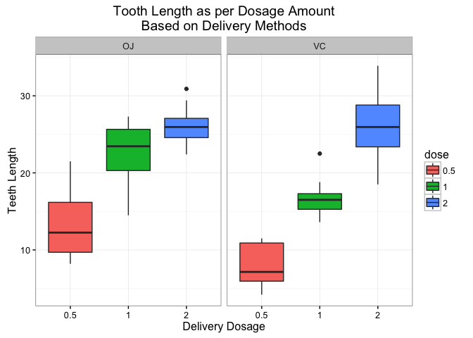

# Statistical Inference - Basic Inferential Data Analysis
Bibek Karki  
2/26/2017  


# Inferential Analysis of ToothGrowth Data

## Overview

This is Part II of the course project for Statistical Inference class. We will load ToothGrowth data in R datasets package and perform some exploratory data analysis and statistical inference. The dataset contains 60 observations where the response is the length of odontoblasts in 60 guinea pigs. Orange juice(OJ) or Ascorbic Acid (VC) is supplied at 3 different doses (0.5, 1, 2 mg/day) to study the response.

## Getting and Clening Data

First of all, we will load the libraries required for our analysis:


```r
library(datasets)
library(ggplot2)
library(knitr)
```

Now we'll load the data and output the basic summary.


```r
# Load the data
data("ToothGrowth")
# General summary
summary(ToothGrowth)
```

```
##       len        supp         dose      
##  Min.   : 4.20   OJ:30   Min.   :0.500  
##  1st Qu.:13.07   VC:30   1st Qu.:0.500  
##  Median :19.25           Median :1.000  
##  Mean   :18.81           Mean   :1.167  
##  3rd Qu.:25.27           3rd Qu.:2.000  
##  Max.   :33.90           Max.   :2.000
```

The summary of dosage looks bit unusual if it were in fact a continuous variable, so we'll check the unique values to make sure.


```r
# Unique Values
unique(ToothGrowth$dose)
```

```
## [1] 0.5 1.0 2.0
```

Since the doses are more of a factor than continuous numbers, we will convert them into factors.


```r
# Coverting to factors
ToothGrowth$dose <- as.factor(ToothGrowth$dose)
```

## Exploratory Data Analysis

We will perform a box plot to get a better overview of the ToothGrowth data


```r
g <- ggplot(data = ToothGrowth, aes(x = dose, y = len))
g <- g + facet_grid(.~supp)
g <- g + geom_boxplot(aes(fill = dose))
g <- g + theme_bw()
g <- g + labs(title = "Tooth Length as per Dosage Amount\nBased on Delivery Methods",
              x = "Delivery Dosage",
              y = "Teeth Length")
print(g)
```

<!-- -->

Based on the boxplot, it seems like the teeth growth depends more on the dosage amount rather than delivery method. Let us perform statistical inference to numerically verify the observation.

## Hypothesis Testing

### Teeth Growth by Supplement t-test

We will perform two sample t-test againts null hypothesis that true difference in mean is equal to 0, ie. Delivery type doesn't affect the response.


```r
# Perform t-test
t.test(len~supp, data = ToothGrowth, paired = FALSE, var.equal = FALSE)
```

```
## 
## 	Welch Two Sample t-test
## 
## data:  len by supp
## t = 1.9153, df = 55.309, p-value = 0.06063
## alternative hypothesis: true difference in means is not equal to 0
## 95 percent confidence interval:
##  -0.1710156  7.5710156
## sample estimates:
## mean in group OJ mean in group VC 
##         20.66333         16.96333
```

Since the p-value 0.06 > 0.05 and the fact that confidence interval includes 0, we fail to reject the null hypothesis. This implies that the two different delivery methods (OJ vs. VC) has no noticable difference in teeth growth.

### Tooth Growth by Dosage Amount t-test

Since we have three different dosage amount of 0.5 mg/day, 1 mg/day and 2 mg/day, we have to look at 3 different dosage pairs for t-test.

#### 0.5 mg/day vs. 1 mg/day


```r
# Collect data with dosage 0.5 and 1.0
dose1 <- subset(ToothGrowth, ToothGrowth$dose %in% c(0.5,1.0))
# Perform t-test
t.test(len~dose, data = dose1, paired = FALSE, var.equal = FALSE)
```

```
## 
## 	Welch Two Sample t-test
## 
## data:  len by dose
## t = -6.4766, df = 37.986, p-value = 1.268e-07
## alternative hypothesis: true difference in means is not equal to 0
## 95 percent confidence interval:
##  -11.983781  -6.276219
## sample estimates:
## mean in group 0.5   mean in group 1 
##            10.605            19.735
```

#### 1 mg/day vs. 2 mg/day


```r
# Collect data with dosage 1.0 and 2.0
dose2 <- subset(ToothGrowth, ToothGrowth$dose %in% c(1.0,2.0))
# Perform t-test
t.test(len~dose, data = dose2, paired = FALSE, var.equal = FALSE)
```

```
## 
## 	Welch Two Sample t-test
## 
## data:  len by dose
## t = -4.9005, df = 37.101, p-value = 1.906e-05
## alternative hypothesis: true difference in means is not equal to 0
## 95 percent confidence interval:
##  -8.996481 -3.733519
## sample estimates:
## mean in group 1 mean in group 2 
##          19.735          26.100
```

#### 0.5 mg/day vs. 2 mg/day


```r
# Collect data with dosage 0.5 and 2.0
dose3 <- subset(ToothGrowth, ToothGrowth$dose %in% c(0.5,2.0))
# Perform t-test
t.test(len~dose, data = dose3, paired = FALSE, var.equal = FALSE)
```

```
## 
## 	Welch Two Sample t-test
## 
## data:  len by dose
## t = -11.799, df = 36.883, p-value = 4.398e-14
## alternative hypothesis: true difference in means is not equal to 0
## 95 percent confidence interval:
##  -18.15617 -12.83383
## sample estimates:
## mean in group 0.5   mean in group 2 
##            10.605            26.100
```

#### Result

Since the p-value for each pair is essentially 0 and the confidence interval far below 0, we can reject the null hypothesis. Thus, we can conclude that dosage amount directly impacts the teeth growth.

## Conclusion and required Assumption

### Assumption

Before we state the conclusion, it is important to note down all the required assumptions:

1. The collected data were an IID random samples representative of the population.
2. The distribution of sample mean is approximately normal. This means large enough sample size (n) were used to hold the Central Limit Theorem valid.
3. Unequal variance were assumed for the population we derived the sample means from.

### Conclusion

Based on the above stated assumptions, the conclusion are as follows:

1. The two different supplement types has no noticable difference in teeth length.
2. Across both delivery methods, there is significant difference between teeth length and dosage levels. Higher dosage level consistently led to a longer teet length.
