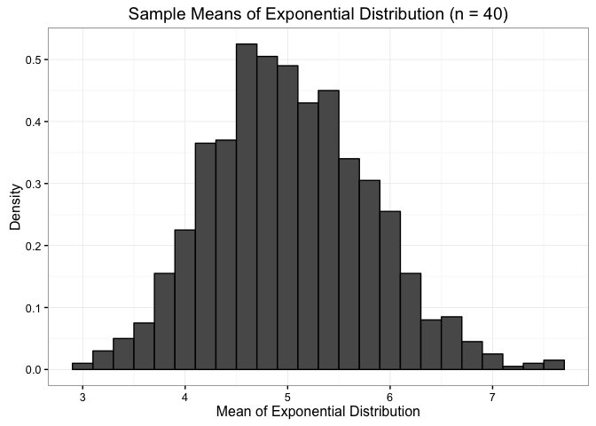
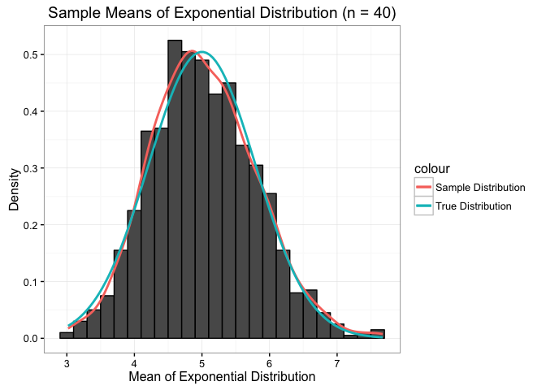

# Statistical Inference - Simulation Exercise
Bibek Karki  
02/26/2017  


# Investigation of the Exponential Distribution

## Overview

This is Part I of the course project for Statistical Inference class. In this project we will investigate Exponential Distribution for $\lambda = 0.20$. We will investigate the distribution of averages of 40 exponentials using 1000 sets of simulations.

The following properties of the distribution of the mean of 40 exponentials are investigated:

1. The sample mean is compared with the theoretical mean of the distribution
2. The sample variance is compared with the theoretical variance of the distribution
3. Check if the sample distribution is approximately normal.

## Data Simulation

We will set the required parameters and construct the simulated data. We will also set seed for reprodicibility.


```r
#Constants
lambda <- 0.2
num_sim <- 1000
n <- 40
```


```r
# Set seed
set.seed(2001)
# 1000 sets of means of 40 exponential distribution
means <- NULL
for (i in 1 : num_sim) {
        means <- c(means, mean(rexp(n,lambda)))
}

means <- data.frame(means)
```

We will also load the required libraries.


```r
library(ggplot2)
library(knitr)
```

Now lets plot the distribution of sample means with $n = 40$.


```r
# Setting up ggplot
g <- ggplot(data = means, aes(x = means))
g <- g + geom_histogram(binwidth = lambda,
                        color = "black", aes(y = ..density..))
g <- g + theme_bw()
g <- g + labs(title = "Sample Means of Exponential Distribution (n = 40)",
              x = "Mean of Exponential Distribution",
              y = "Density")
# output plot
print(g)
```

<!-- -->

## Sample Mean compared to Theoretical Mean

The sample mean and theoretical mean are as follows:


```r
# Assigning mean variable
sampleMean <- mean(means$means)
trueMean <- 1/lambda
# Printthe output 
sprintf("Sample mean: %.3f", sampleMean)
```

```
## [1] "Sample mean: 5.024"
```

```r
sprintf("Theoretical mean: %.3f", trueMean)
```

```
## [1] "Theoretical mean: 5.000"
```

## Sample Variance compared to Theoretical Variance

The sample variance and theoretical variance are as follows:


```r
# Assign variance variable
sampleVariance <- sd(means$means)^2
trueVariance <- 1/(lambda^2 * n)
# Print the output
sprintf("Sample Variance: %.3f", sampleVariance)
```

```
## [1] "Sample Variance: 0.599"
```

```r
sprintf("Theoretical Variance: %.3f", trueVariance)
```

```
## [1] "Theoretical Variance: 0.625"
```

## Distribution of Sample Mean

Based on Central Limit Theorem, it is expected of sample mean distribution to be approximately normal given the relatively large sample size of 40. And we see similar result in histogram plot. Nonetheless, let us proceed even further and overlay true distribution plots for a better overview of our sample distribution.


```r
# Continue with the plot that we produced earlier
g <- g + geom_line(aes(y = ..density.., col = "Sample Distribution"),
                   stat = "density", size = 1)

g <- g + stat_function(fun=dnorm,
                       args=list(mean=trueMean, sd=sqrt(trueVariance)),
                       aes(col = "True Distribution"), size = 1)
# Output plot
print(g)
```

<!-- -->

When normal distribution with **$\mu$ 5** and **$\sigma^2$ 0.625** is overlayed on top of density plot of sample distribution, we observe a close resemblance as seen in the second figure. This result verified Central Limit Theorem.

## Summary

After investigating an exponential distribution simulations, the observed and true test statistic are as follows:


Statistic    True Value   Sample Value
----------  -----------  -------------
Mean              5.000          5.024
Variance          0.625          0.599

Since we were investigating distribution of Sample means, we were also able to verify Central Limit Theorem based on our result as seen in the second figure.
